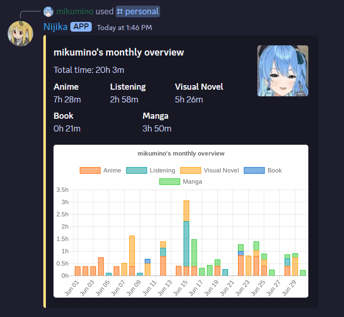
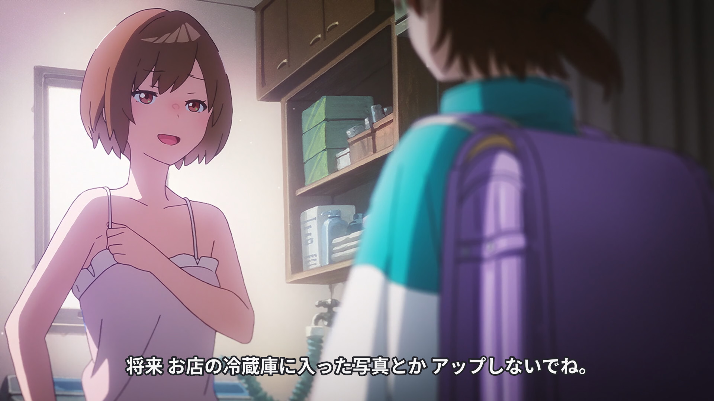
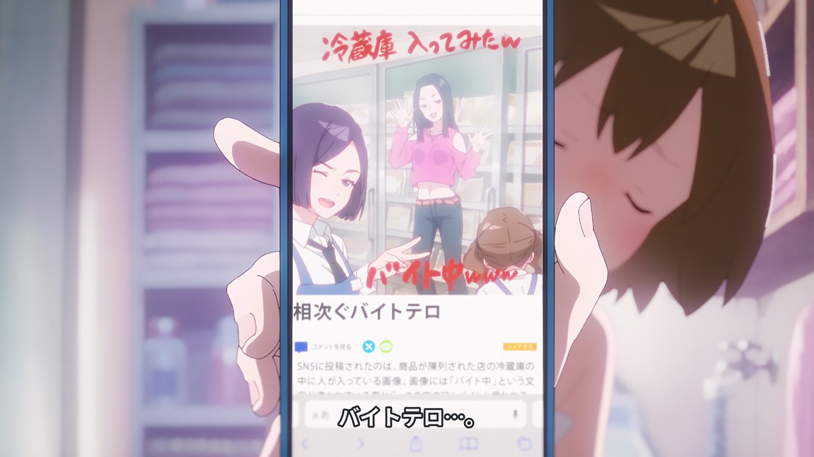
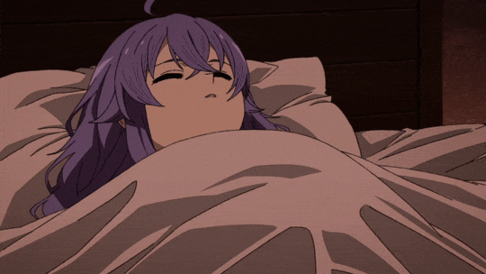
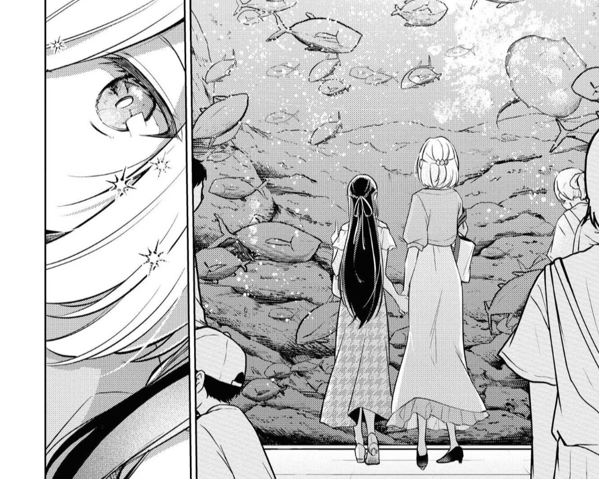

This is a monthly report for my Japanese learning where I basically just dump all thoughts related to learning the language. You can read the rest of the reports... later, because this is the first one I'm writing :P

## Monthly Report (June 2024)
It's been over a month since I've graduated from university and a lot has changed since then. I was lucky enough to be able to scoop up a software development job that I started at the beginning of this month, and that, in addition to a whole bunch of other personal stuff, has left a lot less time for me to dedicate to Japanese. In fact, I believe this is the least amount of time I've tracked for immersion since I started tracking my immersion!

While it *is* a bit sad that I haven't been able to watch or read things as much as I want to, I'm glad it comes at a time where I'm generally busy and I'm not just wasting my time. Unfortunately, I did miss a few days (still did Anki on those days though 😏). Any immersion, though, is better than no immersion and I've thankfully been able to sneak some in every now and then. Something I noticed in this month's stats compared to my normal stats is that visual novels are not my highest category even though they usually are. I suspect that it's most likely because when I get back from work, it's just easier for me to process anime than visual novels. 
## What I've been watching and reading
This month, in terms of anime, I've been watching [Jellyfish Can't Swim in the Night](https://anilist.co/anime/163078/Jellyfish-Cant-Swim-in-the-Night/) as well as [Mushoku Tensei II Part 2](https://anilist.co/anime/166873/Mushoku-Tensei-Jobless-Reincarnation-Season-2-Part-2/). Both were airing during the Spring 2024 season and, at the time of writing, both have also just wrapped up, though I have yet to watch the final episode of Mushoku Tensei. I *have* finished Yorukura though, and I'm unfortunately pretty mixed on it. 
### Yorukura
Comprehension wise, the anime was fairly easy at my current level, with pretty standard daily vocabulary. I can't think of any specific time where I felt like I was falling behind on the dialogue or story which was great. One of my friends, though, caught a potential reference to some [2013 controversy](https://www.itmedia.co.jp/news/amp/1307/15/news009.html) regarding a photo of a Lawson employee laying inside of an ice cream case and I totally missed it.

Overall, I would say I liked the anime, but I will also say that it did not live up to the expectations I had for it from the beginning of the series. The show starts off *really* strong, like *really, really* strong. As the series continued, though, it felt like its focus was wavering. It felt like they had tried to cram far too much into a single season of anime, leaving certain plot points to be developed very underwhelmingly. The show fell into a series of dramatic character backstories that I think would have been much more natural to see in more than just 12 episodes. Despite that, I don't think it totally fell flat on its face, and the finale felt sufficient. I'd still recommend giving the show a shot, if not for the story, then for the incredible visuals and atmosphere.
### Mushoku Tensei
I started watching Mushoku Tensei pretty early on in my Japanese learning journey. Back then, I remember feeling like it was surprisingly easy, and I still stand by that to this day. I would still say Mushoku Tensei is a relatively easy anime in the isekai and fantasy realm, and to make things better, it's also probably my favorite isekai. The first season was incredible, and while the second season slowed things down a bit until the end, it was still excellent. I want to avoid major spoilers, but it was so gratifying to see Rudy really start to show his development, as well as the fact that he still has a lot more growing up to do. The season ends with some pretty heartbreaking stuff and it was all just incredible to watch. I highly recommend it!

### The Summer You Were There
[The Summer You Were There](https://anilist.co/manga/117620/The-Summer-You-Were-There/) is a yuri manga that I started this month and I am *so* into it. I'm about halfway through and the art is incredible, the writing and characters are extremely compelling, and to top it all off, it is very comprehensible for me! In terms of everything I'm immersing with this month, it's by far the easiest for me to read, and that makes it really nice to just freeflow when I have a small amount of time to spare. Because I'm only halfway, I won't say too much, but I have a feeling this manga will destroy me and have me feeling every emotion. 

### Confessions
A revenge thriller, [Confessions](https://letterboxd.com/film/confessions/) was something I watched off of a recommendation from Gigguk on the Trash Taste podcast and I really enjoyed it! It had me fully immersed and paying attention, and it was a fairly unique film, especially in regards to how it lays out the story. The structure is dissimilar to most films I've seen (but I will say I don't really watch many movies) and that made it very interesting to me,

In terms of language, this was probably the hardest thing I'd watched this month, not necessarily because of the vocabulary, but because of the speed. I primarily watch anime and read visual novels, so listening to more realistic spoken dialogue is a bit more difficult. Far from impossible though, I was still able to keep up with everything that happened and thoroughly enjoyed following along.

### Everything else
Beyond those, I'm also continuing some visual novels like Aokana and Higurashi and thoroughly enjoying those. While I'm making incredibly slow progress through both (lol), they're both very nice to read. Their length also makes it so that I can actually feel myself improving while I'm reading them which is awesome. YouTube is something I want to watch more of, and while I explored some new content throughout this month, I have yet to find someone that really draws me in. 

## Current ability and goals
I'm pretty happy with my current level of the language. My reading is definitely much stronger than my listening, and because of that, I want to try to watch a lot more YouTube throughout July. Hearing real conversations and Japanese and being able to follow along is a great feeling when I'm able to, but I do feel a significant gap between my ability to do that in spoken media compared to written media. I think watching more YouTube will also let me become more familiar with more nuanced things like what words natives *actually* use and how certain ideas are worded in casual conversation as opposed to fiction. 

Other than that, my goals stay the same, I want to continue learning the language, keep watching stuff, keep reading stuff, and just keep having a good time 😀!