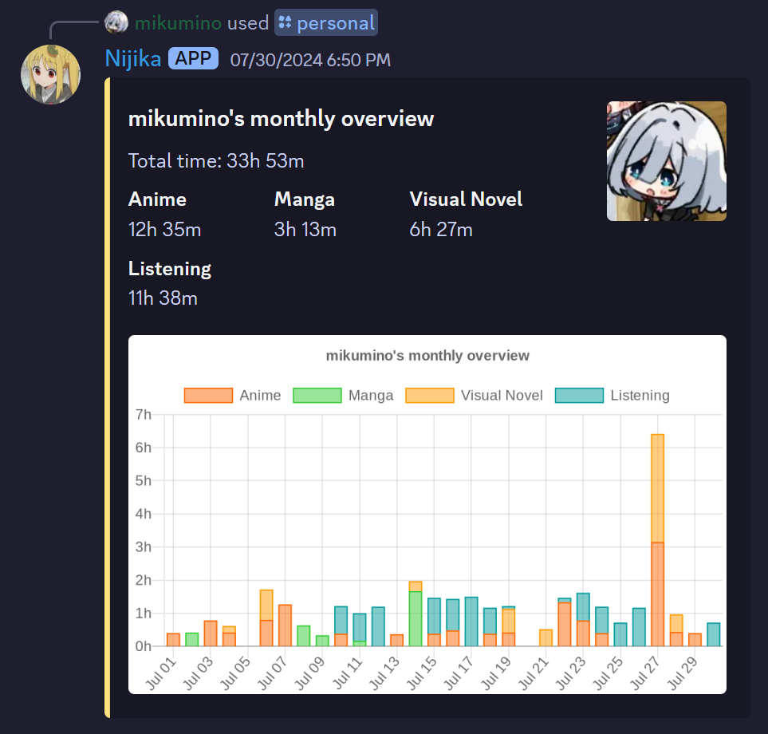

This is a monthly report for my Japanese learning where I basically just dump all thoughts related to learning the language.

## Monthly Report (July 2024)
Somehow, another month has already passed. I've been working for two months now and after getting more acquainted with my new life, I've been able to make more time for Japanese! Not as much as before, but a reasonable amount I'd say. While I feel like I could optimize my time even further, I would say I'm pretty satisfied with the amount of immersion I was able to get out of this month. Hopefully next month will be even better! Here are the results (minus the 31st oops):

That's a 70% increase over last month's numbers. A bit of an unfair comparison since last month was an especially bad month for me, but it's an improvement nonetheless. Looking at the graph, you might notice something interesting. There was one day in particular where I immersed for significantly longer than any other day (lol). Because my numbers have been stagnating overall recently I wanted to try just giving it my all on one day, and the result was a whole lot of Aokana and random anime. The funny thing is that while I *said* I wanted to give it my all, I definitely didn't. I still spent a lot of time doing other things, being generally distracted, or just taking veeery extended meal breaks, but I don't think that's necessarily a bad thing. I still got more time in with Japanese than I normally do, and I was able to do things outside of it too. 

## Listening (or lack thereof)
But I am once again getting distracted. Another thing you might notice about my graph is that visual novels are once again not my highest category, and not even my second highest category. This was intentional. Something I've slowly come to realize over the course of my Japanese learning is that my listening is **bad**. It's *really* bad. At least compared to my reading. I go on-and-off with watching anime without Japanese subtitles, but usually end up just going back to using them since I have higher comprehension with them. Combine that with my highest category usually being visual novels and I ended up with a significant gap between my reading and listening. While both mediums that I immerse in the most (visual novels and anime) *do* feature spoken Japanese, I found that since I've created such a big gap between my reading and listening, I was getting more and more reliant on my reading. This did not necessarily lead to my listening failing to improve, but more so a significant comprehension difference that bothered me. It was frustrating hearing something and failing to comprehend it only to see the written form of it and find out how simple of a sentence it was. So, in an attempt to remedy this, I made a few changes.

The first change was that I was ditching subs for anime. I still had them available for lookups and mining, but when watching anime, I wanted no subtitles on the screen. The second change was that I wanted to try listening to audio-only content, like podcasts. I listen to the Trash Taste podcast quite often, so I'm not new to podcasts, but I had never really done so in Japanese. Finally, the last change I wanted to make was watching a lot more YouTube. I've enjoyed some Japanese content on YouTube in the past, but had not been able to find anyone that really hooked me. With these changes, I went into the month hoping that I could work towards "fixing" my listening to an extent.
## Anime without subtitles
As I had said before, watching anime subless is something that I've been very inconsistent with. I would have attempts every now and then but never stuck to it for very long. This time though, I've been able to actually stick to it. It has humbled me an insane amount, and at first I really hated it. It instantly dropped my comprehension quite low on anything that wasn't slice of life. However, I knew it was just a pure listening issue because if I checked what I heard against the subs, I'd almost always find that the sentence was very easy in written form. I just needed to get used to pure listening. And so I continued, watching basically every show without subtitles. Throughout the month, I watched [My Deer Friend Nokotan](https://anilist.co/anime/175977/My-Deer-Friend-Nokotan/), [Makeine](https://anilist.co/anime/171457/Makeine-Too-Many-Losing-Heroines/), [Welcome to the NHK!](https://anilist.co/anime/1210/Welcome-to-the-NHK/), [Alya Sometimes Hides Her Feelings in Russian](https://anilist.co/anime/162804/Alya-Sometimes-Hides-Her-Feelings-in-Russian/), and [Girls Band Cry](https://anilist.co/anime/164212/Girls-Band-Cry/). Half of these are currently airing, and I'm enjoying pretty much all of them. I will continue these and hopefully become cracked at listening!
## 